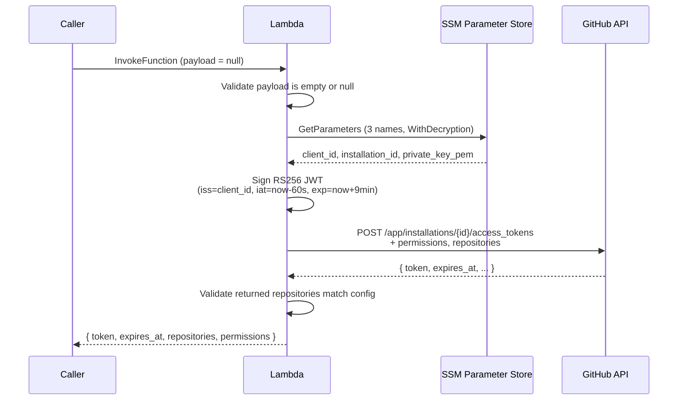

# Architecture

## Components

```mermaid
flowchart LR
  Caller["Caller<br/>(role or service)"]
  subgraph AWS[AWS account]
    direction TB
    Lambda["Lambda function<br/>Go · arm64 · provided.al2023"]
    Role["IAM role<br/>(ssm:GetParameters,<br/>kms:Decrypt*, logs:Put*)"]
    SSM[("SSM Parameter Store<br/>/github-token-broker/app/*")]
    Logs[("CloudWatch Logs")]
    Lambda -.assumes.-> Role
    Lambda -->|reads| SSM
    Lambda -->|writes| Logs
  end
  GitHub["GitHub API<br/>(github.com or GHES)"]
  Caller -->|InvokeFunction<br/>empty payload| Lambda
  Lambda -->|POST /app/installations/<br/>&#123;id&#125;/access_tokens| GitHub
  Lambda -->|token JSON| Caller
```

The broker is one AWS Lambda function with one IAM role. It reaches out to SSM Parameter Store (in the same account) and the GitHub API (over the public internet or via a VPC route). CloudWatch Logs captures the operational log lines. Nothing else is in the picture.

`kms:Decrypt` on the role is conditional — it is only granted when the SSM SecureString parameter uses a customer-managed KMS key. See [IAM permissions](../reference/iam-permissions).

## Token-mint flow

Every invocation runs the full flow. Nothing is cached across invocations — the SSM call and the JWT sign run every time.

## State

The broker is stateless. There is no database, no cache, no disk writes. Every field in the response is derived from the current invocation's SSM reads and GitHub API response.

## Cold start shape

On a cold start, Go bootstraps (fast — the binary is ~7 MB statically linked) and the first invocation runs the full mint flow. There is no warmup or prefetch. Steady-state invocation latency is dominated by three network round trips: SSM `GetParameters`, GitHub `POST /access_tokens`, and the invocation return. Each is typically sub-100 ms in the same AWS region.

## Boundaries

- The broker does not receive long-lived credentials from the caller. It has no notion of caller identity beyond "whoever invoked me."
- The broker does not accept caller input. The scope of the minted token is fixed at deploy time via module inputs — see [Why empty payloads are enforced](./why-empty-payloads) and [Why permissions are deploy-time](./why-permissions-are-deploy-time).
- The broker does not persist tokens. Once returned, the token is the caller's responsibility.

## See also

- [Security model](./security-model) — what the architecture defends against.
- [Release architecture](./release-architecture) — how the Lambda zip gets built and verified.
- [IAM permissions](../reference/iam-permissions) — the role's exact policy.
